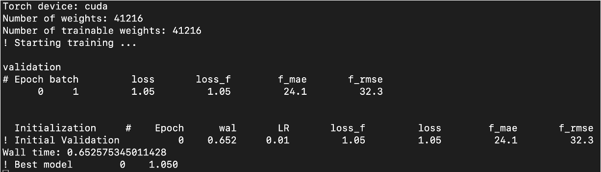
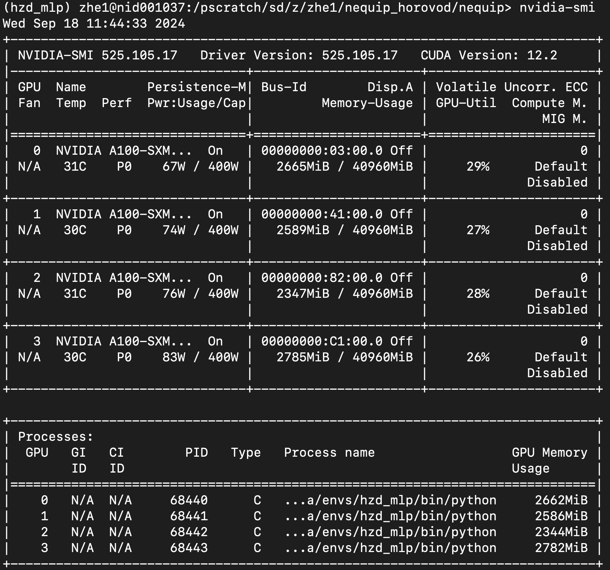

Practical use of NequIP
===========================

Install NequIP
----------------

By following the commands below, you should be able to install NequIP on your local machine or HPC (e.g. Kestrel from NREL).

.. code-block:: bash

    module load anaconda3
    conda create -n nequip python 
    conda activate nequip 
    pip3 install torch torchvision torchaudio --index-url https://download.pytorch.org/whl/cu124 # for CUDA 12.4
    pip3 install wandb # for visualizing the training process
    git clone https://github.com/mir-group/nequip.git
    cd nequip; pip3 install .

In order to test whether the installation is successful, we can run the following command:

.. code-block:: bash

    cd nequip
    nequip-train config/minimal.yaml

If the installation is successful, you should see the following output:

    If you get similar outputs as above, the installation is successful. 

Apply for an interactive mode on supercomputer
-----------------------------------------------

.. code-block:: bash

    # Perlmutter
    salloc --nodes 1 --qos interactive --time 04:00:00 --constraint gpu --gpus 4 --account m4238_g
    salloc --nodes 2 --qos interactive --time 04:00:00 --constraint gpu --gpus 8 --account m4238_g --exclusive

    # Kestrel
    salloc --nodes 1 --account=cmos --time=6:00:00 --gres=gpu:4 --mem-per-gpu=80G
    salloc --nodes 2 --account=cmos --time=6:00:00 --gres=gpu:8 --mem-per-gpu=80G

Generating training data for NequIP
--------------------------------------
Here's the script (:code:`extract_ase_split.py`) for generating training data for NequIP.

It's usage is:

:: 

    python extract_ase_split.py -n 10 --n_jobs 10000 --conv_jobs_file convJobs_Relax.mson --split 0.8 0.1 0.1
    # -n 10: use 10 cores for parallel processing
    # --n_jobs 10000: process 10000 jobs
    # --conv_jobs_file convJobs_Relax.mson: the file that contains the location of converged jobs
    # --split 0.8 0.1 0.1: split the data into 80% training, 10% validation, 10% test

Here's the script for generating training data for NequIP.

.. code-block:: python

    import os
    import argparse
    from random import shuffle
    from multiprocessing import Pool
    from monty.serialization import loadfn, dumpfn
    from pymatgen.core.periodic_table import Element
    from ase.io import read, write
    import numpy as np

    def process_job(job):
        print(f"Processing {job}", flush=True)
        os.chdir(job)

        try:
            if 'vasprun.xml.xz' in os.listdir():
                os.system('xz --decompress vasprun.xml.xz')
            lst_structures = read('vasprun.xml', index=':') # index=':' to read all structures
            os.system('xz vasprun.xml')

            # Extract unique elements from the atoms object
            unique_elements = list(set(lst_structures[-1].get_chemical_symbols()))
        except:
            return None, None

        return lst_structures, unique_elements

    def collect_unique_elements(results):
        all_elements = set()
        for _, elements in results:
            if elements is not None:
                all_elements.update(elements)
        return sorted(list(all_elements), key=lambda x:Element(x).Z)

    if __name__ == "__main__":
        parser = argparse.ArgumentParser(description="Extract ASE structures in parallel.")
        parser.add_argument("-n", "--num_cores", type=int, default=1, help="Number of cores to use")
        parser.add_argument("--n_jobs", type=int, default=None, help="Number of jobs to process")
        parser.add_argument("--conv_jobs_file", type=str, default="convJobs_Relax.mson", help="Filename of conv_jobs")
        parser.add_argument("--split", nargs=3, type=float, default=[0.8, 0.1, 0.1],
                            help="Split ratio for training, validation, and test sets")
        args = parser.parse_args()

        # Ensure split ratios sum to 1
        if sum(args.split) != 1:
            raise ValueError("Split ratios must sum to 1")

        currloc = os.getcwd()
        ase_structures_dir = f'{currloc}/ase_structures'
        os.makedirs(ase_structures_dir, exist_ok=True)

        all_conv_jobs = loadfn(f'{currloc}/{args.conv_jobs_file}')
        shuffle(all_conv_jobs) # shuffle the jobs to avoid bias
        n_jobs = min(args.n_jobs, len(all_conv_jobs)) if args.n_jobs else len(all_conv_jobs)
        conv_jobs = all_conv_jobs[:n_jobs]

        with Pool(processes=args.num_cores) as pool:
            results = pool.map(process_job, conv_jobs)

        # Collect all good structures
        all_structures = []
        for result in results:
            if result[0] is None:
                continue
            for struct in result[0]:
                try:
                    forces = struct.get_forces()
                    if len(forces) > 0:
                        all_structures.append(struct)
                except:
                    continue

        # Shuffle all structures
        shuffle(all_structures)

        # Split structures based on the provided ratios
        total_structures = len(all_structures)
        split_indices = [int(ratio * total_structures) for ratio in args.split]

        train_structures = all_structures[:split_indices[0]]
        val_structures = all_structures[split_indices[0]:split_indices[0]+split_indices[1]]
        test_structures = all_structures[split_indices[0]+split_indices[1]:]

        # Collect unique elements
        unique_elements = collect_unique_elements(results)

        # Write structures to files
        write(f'{ase_structures_dir}/training.xyz', train_structures, format='extxyz')
        write(f'{ase_structures_dir}/validation.xyz', val_structures, format='extxyz')
        write(f'{ase_structures_dir}/test.xyz', test_structures, format='extxyz')

        # Save unique elements to a .mson file
        dumpfn(unique_elements, f'{ase_structures_dir}/unique_elements.mson')

        print(f"Unique elements: {unique_elements}", flush=True)
        print(f"Processed {len(train_structures)} training structures", flush=True)
        print(f"Processed {len(val_structures)} validation structures", flush=True)
        print(f"Processed {len(test_structures)} test structures", flush=True)

After the splitting of the DFT results, you will find :code:`training.xyz`, :code:`validation.xyz`, :code:`test.xyz` in the directory :code:`ase_structures/`. You can easily change the location by adding additional arguments to the script.

Modify the config file 
------------------------

We need a config file for training NequIP model. There are several examples given in the git repo, so in here we only need to show how to change its parameters using python.

.. code-block:: python

    import yaml
    from monty.serialization import loadfn

    # read yaml file
    with open('example.yaml', 'r') as f:
        data = yaml.safe_load(f)
    
    # change some parameters
    data['root'] = f'{currloc}/scaling_test_nequip/num_gpu_{num_gpu}/test_{num_gpu}_gpu'
    data['run_name'] = f'run_folder_{num_gpu}_gpu' # folder name of current run
    data['dataset_file_name'] = f'{currloc}/scaling_test_nequip/dataset/input.xyz'
    ele_lst = loadfn(f'../dataset/unique_elements.mson')
    data['chemical_symbols'] = ele_lst
    data['max_epochs'] = 10
    data['wandb_project'] = f'scaling_test_nequip'
    data['n_train'] = num_train
    data['n_val'] = num_validation
    data['batch_size'] = 4 * num_gpu
    data['validation_batch_size'] = 12 * num_gpu

    # dump yaml file
    with open('my_dump.yaml', 'w') as f:
        yaml.dump(data, f, sort_keys=False) # sort_keys=False will prevent the reordering of the keys

    # one caveat would be after the modification, all the comments will be removed, which will be much more cleaner.

Since NequIP uses :code:`DistributedDataParallel`, which means different GPUs will handle different batches, so we need to make the batch size larger so that it can be distributed evenly on different GPUs.

Training a NequIP model
--------------------------------

Using one GPU 
~~~~~~~~~~~~~~~

Here's the script for training a NequIP model.

.. code-block:: bash

    nequip-train config/your_config.yaml

After successful training, you will get :code:`best_model.pth` in the directory :code:`results/`.

Using multiple GPUs
~~~~~~~~~~~~~~~~~~~~~

You can download the :code:`ddp` branch (:code:`ddp` means distributed data parallel, which is partition the data, when training a really large model, the model can also be partitioned into multiple GPUs) from the NequIP `github repo <https://github.com/mir-group/nequip.git>`_ and also download the :code:`state-reduce` branch from `pytorch_runstats package <https://github.com/mir-group/pytorch_runstats.git>`_ : 

.. code-block:: bash

    git clone -b ddp https://github.com/mir-group/nequip.git
    git clone -b state-reduce https://github.com/mir-group/pytorch_runstats.git

Then install the package with the following command:

.. code-block:: bash

    # install nequip
    cd nequip
    pip3 install .

    # install pytorch_runstats
    cd ../pytorch_runstats
    pip3 install .

Then you can use the following command to train the model with multiple GPUs:

.. code-block:: bash

    #!/usr/bin/env bash
    export OMP_NUM_THREADS=32
    nohup torchrun --nnodes 1 --nproc_per_node 4 `which nequip-train` config/IM_surf_4096.yaml --distributed > nequip.log &

Also you need to make sure that :code:`batch_size`, :code:`validation_batch_size`, :code:`n_train`, :code:`n_val` are all divisible by the number of GPUs you are using.

There is a very detailed discussion in this issue: `here <https://github.com/mir-group/nequip/issues/210>`__.

I have tested the code with 4 GPUs on Perlmutter, and here's the results:

    Training NequIP with 4 GPUs (A100-40GB) on Perlmutter. You can see all four GPUs are utilized.

.. warning::

    When using multiple GPUs, the connection to wandb will be strange, since all GPUs will try to push the data to wandb server. Right now it seems there is no good solution to this problem. 

.. warning::

    On :code:`Kestrel`, the multi_GPU version of NequIP cannot be run, it will show the following error:

    .. code:: shell

        torch.distributed.DistBackendError: [3] is setting up NCCL communicator and retrieving ncclUniqueId from [0] via c10d key-value store by key '0', but store->get('0') got error: Socket Timeout

    But surprisingly, if we are using the interactive node mode (:code:`salloc`), the multi-GPU code can run successfully. Still don't know what's the reason.

    2024/09/21 - 17:53 I got the reason, I need to add :code:`#SBATCH --exclusive` in the job script, then the multi-GPU code can run successfully.

Job script on Perlmutter
^^^^^^^^^^^^^^^^^^^^^^^^^

Here is the job submission script for using NequIP on Perlmutter (NERSC) supercomputer with multiple nodes. I have consulted with NERSC help team and :code:`Steve` is very helpful. He has a good repo about how to run PyTorch on Perlmutter: `here <https://github.com/sparticlesteve/nersc-pytorch-testing/tree/main/scripts>`__.

.. code-block:: bash

    #!/bin/bash
    #SBATCH --job-name=nequip
    #SBATCH --error=%J.err
    #SBATCH --output=%J.out
    #SBATCH --nodes=2
    #SBATCH --time=48:00:00
    #SBATCH --account=m4238_g
    #SBATCH --constraint=gpu
    #SBATCH --ntasks-per-node=1
    #SBATCH --cpus-per-task=128
    #SBATCH --gpus-per-node=4
    #SBATCH --qos=regular
    #SBATCH --exclusive

    module load python/3.9-anaconda-2021.11
    conda init
    conda activate hzd_mlp # your conda environment
    #module load pytorch/2.3.1
    module load nccl/2.17.1-ofi
    #module load nccl

    #export OMP_NUM_THREADS=128
    export MASTER_ADDR=$(hostname)
    export MASTER_PORT=29507

    # copied from Steve's github: https://github.com/sparticlesteve/nersc-pytorch-testing/blob/main/scripts/run_ddp_launch_test.sh
    echo "---------------------------------------------------------------"
    date
    echo "PyTorch distributed launch DDP test"
    echo "Cluster: $SLURM_CLUSTER_NAME"
    echo "Nodes: $SLURM_JOB_NODELIST"
    echo "Tasks/node: $SLURM_NTASKS_PER_NODE"
    echo "Image: $SLURM_SPANK_SHIFTER_IMAGEREQUEST"
    echo "Extra args: $@"
    module list

    srun torchrun \
        --nnodes=2 \
        --nproc-per-node=4 \
        --rdzv-backend=c10d \
        --rdzv-endpoint=$MASTER_ADDR:$MASTER_PORT \
        `which nequip-train` run.yaml --gpu --distributed

Job script on Kestrel
^^^^^^^^^^^^^^^^^^^^^^

Here is the job submission script for using NequIP on Kestrel (NREL) supercomputer.

.. code-block:: bash

    #!/bin/bash
    #SBATCH --job-name=nequip
    #SBATCH --error=%J.err
    #SBATCH --output=%J.out
    #SBATCH --nodes=2
    #SBATCH --ntasks-per-node=1
    #SBATCH --cpus-per-task=104
    #SBATCH --time=48:00:00
    #SBATCH --partition=gpu-h100
    #SBATCH --account=cmos
    #SBATCH --gpus-per-node=4

    module load anaconda3
    conda init
    conda activate pyhzd

    export MASTER_ADDR=$(hostname)
    export MASTER_PORT=29507 # just a random number that is not been used

    echo "---------------------------------------------------------------"
    date
    echo "PyTorch distributed launch DDP test"
    echo "Cluster: $SLURM_CLUSTER_NAME"
    echo "Nodes: $SLURM_JOB_NODELIST"
    echo "Tasks/node: $SLURM_NTASKS_PER_NODE"
    echo "Image: $SLURM_SPANK_SHIFTER_IMAGEREQUEST"
    echo "Extra args: $@"
    module list

    NCCL_DEBUG=INFO srun torchrun \
        --nnodes=2 \
        --nproc-per-node=4 \
        --rdzv-backend=c10d \
        --rdzv-endpoint=$MASTER_ADDR:$MASTER_PORT \
        `which nequip-train` run.yaml --gpu --distributed

Useful scripts for generating input files for NequIP
^^^^^^^^^^^^^^^^^^^^^^^^^^^^^^^^^^^^^^^^^^^^^^^^^^^^^

I also have two scripts for generating input files for NequIP. One is called :code:`run_nequip_multiGPU.py`, the other one is called :code:`nequip.sh`, which is a shell script for running the python script. Here they are:

.. admonition:: run_nequip_multiGPU.py

    .. code-block:: python

        #!/usr/bin/env python

        # Author: Zhengda He
        # Date: 2023-10-05
        #
        # This script is designed to run NequIP with multiple GPUs on different clusters.
        # It generates a submission script based on the specified cluster and submits the job.
        #
        # Usage:
        #     python run_nequip_multiGPU.py --database_path <path_to_database> --config_template <config_template_file> 
        #                                   --num_gpu <number_of_gpus> --num_nodes <number_of_nodes> 
        #                                   --wandb_project_name <wandb_project_name> --cluster_name <cluster_name>
        #
        # Arguments:
        #     --database_path: Path to the database.
        #     --config_template: Name of the config template file.
        #     --num_gpu: Number of GPUs to use, default is 1.
        #     --num_nodes: Number of nodes to use, default is 1.
        #     --wandb_project_name: Name of the wandb project.
        #     --cluster_name: Name of the cluster (e.g., perlmutter, kestrel).
        #
        # Example:
        #     python run_nequip_multiGPU.py --database_path /path/to/database --config_template config.yaml --num_gpu 4 --num_nodes 2 --wandb_project_name my_project --cluster_name perlmutter

        import os 
        import yaml
        from monty.serialization import loadfn
        from ase.io import read
        from math import floor
        import argparse

        def generate_submission_script(cluster_name, num_nodes, num_gpu):
            if cluster_name == 'perlmutter':
                script = f"""#!/bin/bash
        #SBATCH --job-name=nequip
        #SBATCH --error=%J.err
        #SBATCH --output=%J.out
        #SBATCH --nodes={num_nodes}
        #SBATCH --ntasks-per-node=1
        #SBATCH --cpus-per-task=128
        #SBATCH --time=48:00:00
        #SBATCH --account=m4238_g
        #SBATCH --constraint=gpu
        #SBATCH --gpus-per-node={num_gpu}
        #SBATCH --qos=regular

        module load python/3.9-anaconda-2021.11
        conda init
        conda activate hzd_mlp # your conda environment
        module load nccl/2.17.1-ofi

        export MASTER_ADDR=$(hostname)
        export MASTER_PORT=29507 # just a random number that is not been used

        echo "---------------------------------------------------------------"
        date
        echo "PyTorch distributed launch DDP test"
        echo "Cluster: $SLURM_CLUSTER_NAME"
        echo "Nodes: $SLURM_JOB_NODELIST"
        echo "Tasks/node: $SLURM_NTASKS_PER_NODE"
        echo "Image: $SLURM_SPANK_SHIFTER_IMAGEREQUEST"
        echo "Extra args: $@"
        module list

        NCCL_DEBUG=INFO srun torchrun \\
            --nnodes={num_nodes} \\
            --nproc-per-node={num_gpu} \\
            --rdzv-backend=c10d \\
            --rdzv-endpoint=$MASTER_ADDR:$MASTER_PORT \\
            `which nequip-train` run.yaml --gpu --distributed
        """
            elif cluster_name == 'kestrel':
                script = f"""#!/bin/bash
        #SBATCH --job-name=nequip
        #SBATCH --error=%J.err
        #SBATCH --output=%J.out
        #SBATCH --nodes={num_nodes}
        #SBATCH --ntasks-per-node=1
        #SBATCH --cpus-per-task=104
        #SBATCH --time=48:00:00
        #SBATCH --partition=gpu-h100
        #SBATCH --account=cmos
        #SBATCH --gpus-per-node={num_gpu}

        module load anaconda3
        conda init
        conda activate pyhzd

        export MASTER_ADDR=$(hostname)
        export MASTER_PORT=29507 # just a random number that is not been used

        echo "---------------------------------------------------------------"
        date
        echo "PyTorch distributed launch DDP test"
        echo "Cluster: $SLURM_CLUSTER_NAME"
        echo "Nodes: $SLURM_JOB_NODELIST"
        echo "Tasks/node: $SLURM_NTASKS_PER_NODE"
        echo "Image: $SLURM_SPANK_SHIFTER_IMAGEREQUEST"
        echo "Extra args: $@"
        module list

        NCCL_DEBUG=INFO srun torchrun \\
            --nnodes={num_nodes} \\
            --nproc-per-node={num_gpu} \\
            --rdzv-backend=c10d \\
            --rdzv-endpoint=$MASTER_ADDR:$MASTER_PORT \\
            `which nequip-train` run.yaml --gpu --distributed
        """
            else:
                raise ValueError(f"Unsupported cluster: {cluster_name}")

            with open(f'job_nequip_{cluster_name}.sh', 'w') as f:
                f.write(script)
            print(f'Submission script for {cluster_name} generated as job_nequip_{cluster_name}.sh', flush=True)

        if __name__ == '__main__':
            currloc = os.getcwd()
            os.environ['OMP_NUM_THREADS'] = '32'

            parser = argparse.ArgumentParser(description='Run NequIP with multiple GPUs')
            parser.add_argument('--database_path', type=str, required=True,
                                help='Path to the database')
            parser.add_argument('--config_template', type=str, required=True,
                                help='Name of the config template file')
            parser.add_argument('--num_gpu', type=int, required=True, default=1,
                                help='Number of GPUs to use, default is 1')
            parser.add_argument('--num_nodes', type=int, required=True, default=1,
                                help='Number of nodes to use, default is 1')
            parser.add_argument('--wandb_project_name', type=str, required=True,
                                help='Name of the wandb project')
            parser.add_argument('--cluster_name', type=str, required=True,
                                help='Name of the cluster (e.g., perlmutter, kestrel)')
            args = parser.parse_args()

            database_path = args.database_path
            config_template = args.config_template
            num_gpu = args.num_gpu
            num_nodes = args.num_nodes
            cluster_name = args.cluster_name

            print(f'Current location: {currloc}', flush=True)
            print(f'Database path: {database_path}', flush=True )

            print('Checking if input.xyz is exist in dataset folder.', flush=True)
            os.chdir(database_path)
            # if input.xyz is not exist, we need to combine train.xyz and validation.xyz
            if 'input.xyz' not in os.listdir():
                lst_train = read('training.xyz', index=':')
                lst_validation = read('validation.xyz', index=':')

                print('input.xyz is not exist, combining training.xyz and validation.xyz', flush=True)
                os.system(f'cat training.xyz validation.xyz > input.xyz')
            else:
                lst_train = read('training.xyz', index=':', format='extxyz')
                lst_validation = read('validation.xyz', index=':', format='extxyz')
                print('input.xyz exists', flush=True)
            
            os.chdir(currloc)

            print(f'Copying template config file to current directory', flush=True)
            os.system(f'cp {config_template} ./template.yaml')

            print(f'Modifying template.yaml file', flush=True)
            # read yaml file
            with open(f'template.yaml', 'r') as f:
                data = yaml.safe_load(f)
            
            # set number of train and validation data
            num_train = floor(len(lst_train)/num_gpu) * num_gpu
            num_validation = floor(len(lst_validation)/num_gpu) * num_gpu

            # change some parameters
            data['root'] = f'{currloc}'
            data['run_name'] = f'output' # folder name of current run
            data['dataset_file_name'] = f'{database_path}/input.xyz'
            ele_lst = loadfn(f'{database_path}/unique_elements.mson')
            data['chemical_symbols'] = ele_lst
            data['max_epochs'] = 100000 # we can do early stopping based on validation loss
            data['wandb_project'] = args.wandb_project_name
            data['n_train'] = num_train
            data['n_val'] = num_validation
            data['batch_size'] = 16 * num_gpu * num_nodes # this needs to be tested on the GPU to make sure we have enough memory
            data['validation_batch_size'] = 32 * num_gpu * num_nodes # same as above

            # dump yaml file
            with open(f'run.yaml', 'w') as f:
                yaml.dump(data, f, sort_keys=False) # sort_keys=False will prevent the reordering of the keys
            print(f'template config file modified to run.yaml', flush=True)
            
            print(f'Running nequip-train with {num_nodes} nodes and {num_gpu} GPUs per node', flush=True)

            # Generate the submission script
            generate_submission_script(cluster_name, num_nodes, num_gpu)

            os.system(f'sbatch job_nequip_{cluster_name}.sh')
            os.chdir(currloc)

.. admonition:: nequip.sh

    .. code-block:: bash

        #!/usr/bin/env bash

        DATABASEPATH=/pscratch/sd/z/zhe1/IM_surf_prod_NequIP/datasets/dataset_2048
        CONFIG_TEMPLATE=~/template.yaml
        NUM_GPU=4
        NUM_NODES=1
        WANDB_PROJECT_NAME=IM_dataset_1024
        CLUSTER_NAME=perlmutter

        run_nequip_multiGPU.py --database_path $DATABASEPATH --config_template $CONFIG_TEMPLATE --num_gpu $NUM_GPU --num_nodes $NUM_NODES --wandb_project_name $WANDB_PROJECT_NAME --cluster_name $CLUSTER_NAME

.. important::

    If you are using multiple GPU nodes, you need to add :code:`srun` in the submission script. The reason is illustrated in `here <https://https://github.com/pytorch/pytorch/issues/76069>`__ and `here <https://github.com/YunchaoYang/Blogs/issues/3>`__.

Deploy the trained model
--------------------------

Here's the command for deploying the trained model:

.. code-block:: bash

    nequip-deploy build --train-dir path/to/training/session/ where/to/put/deployed_model.pth

Evaluate the trained model
--------------------------------

Here's the script for evaluating the accuracy of predicting total energy for a trained NequIP model.

.. code-block:: python

    from tqdm import tqdm
    import numpy as np
    from ase.io import read
    from nequip.ase import NequIPCalculator
    import math

    def calculate_rmse(list1, list2):
        # Ensure both lists have the same structure
        assert len(list1) == len(list2) and all(len(sublist1) == len(sublist2) for sublist1, sublist2 in zip(list1, list2)), "Lists must have the same structure."  

        # Initialize sum of squared differences
        total_squared_diff = 0
        total_elements = 0

        # Loop through both lists
        for sublist1, sublist2 in zip(list1, list2):
            for val1, val2 in zip(sublist1, sublist2):
                total_squared_diff += (val1 - val2) ** 2
                total_elements += 1

        # Calculate RMSE
        rmse = math.sqrt(total_squared_diff / total_elements)
        return rmse
    
    if __name__=='__main__':

    lst_atoms = read('test.xyz', index=':')

    nequip_calc = NequIPCalculator.from_deployed_model(model_path='location_to_deployed_model.pth')

    lst_e_dft = []
    lst_e_nequip = []

    lst_f_dft = []
    lst_f_nequip = []

    for atoms in tqdm(lst_atoms):
        lst_e_dft.append(atoms.get_potential_energy())
        lst_f_dft.append(atoms.get_forces().tolist()[0])

        # reset the calculation
        atoms.calc = nequip_calc
        lst_e_nequip.append(atoms.get_potential_energy())
        lst_f_nequip.append(atoms.get_forces().tolist()[0])

    np_e_dft = np.array(lst_e_dft)
    np_e_nequip = np.array(lst_e_nequip)

    print(np.corrcoef(np_e_dft, np_e_nequip))
    print(f'The RMSE between forces is: {calculate_rmse(lst_f_dft, lst_f_nequip)}')

If you want to use NequIP as a force field, you can link it with LAMMPS code.

Common errors and how to fix them
----------------------------------

.. error::

    torch.distributed.DistBackendError: [3] is setting up NCCL communicator and retrieving ncclUniqueId from [0] via c10d key-value store by key '0', but store->get('0') got error: Socket Timeout

This error happens when I'm using multiple GPUs to execute the :code:`NequIP` code. For example, if I'm training on 4096 systems on 4 GPUs, it runs well, 

.. error::

    torch.distributed.DistStoreError: Timed out after 901 seconds waiting for clients. 1/2 clients joined.

This error happens when I'm trying to use multiple GPU nodes (e.g. 2 nodes, 8 GPUs per node) to train the model. 

Both cases are related to the NCCL communicator. They are resolved by using the submission script above, which sets up the NCCL communicator correctly. The script works both for Perlmutter and Kestrel.