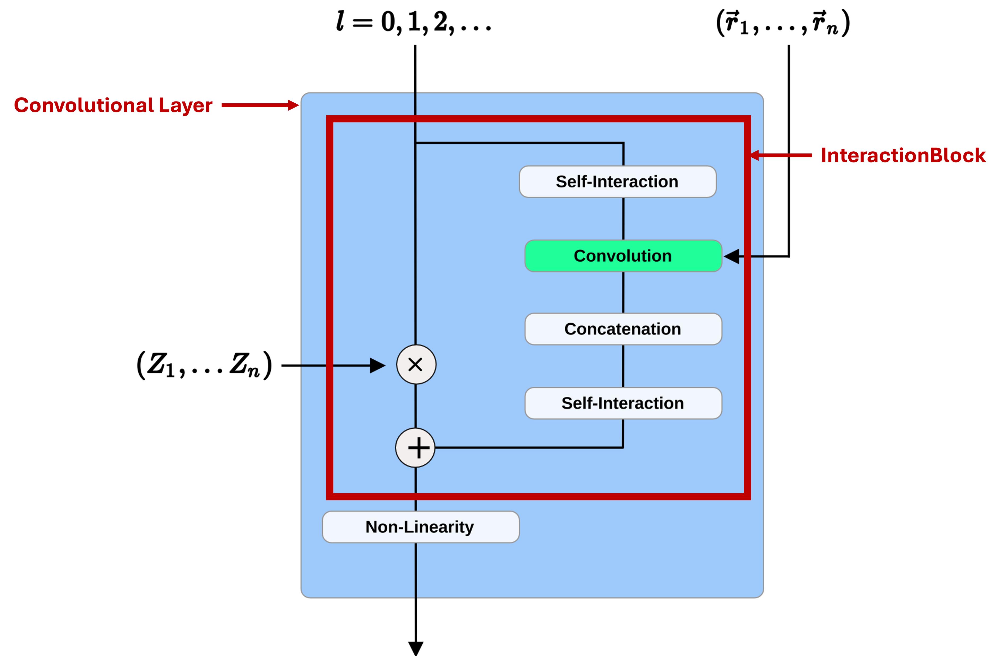

Theoretical background of NequIP
===================================

Any machine learning potential is a mapping from the atomic configurations (:math:`\{\vec{R}_i\}, \{Z_i\}`) to the total energy (:math:`E_{tot}`) for the system and forces (:math:`\vec{F}_i`) for each atom. The goal of machine learning potential is to learn the potential energy surface (PES) from a set of known data (training set), which contains a set of atomic configurations and their corresponding energy, forces and stresses. After training, we can use the learned potential to predict the energy and forces for unseen configurations.

Mathematical foundation of NequIP 
-----------------------------------

**NequIP** is shortened for "Neural Equivariant Interatomic Potential" (`original paper <https://www.nature.com/articles/s41467-022-29939-5>`_). It is a graph neural network (GNN), which maps the atomic structure to a graph, assign features and attributes to atoms and bonds, then use convolutions between nodes and edges to learn representations of the local atomic environments. In the end the features of each atom is used to predict its atomic energy (:math:`E_i`), and the total energy of the system is the sum of atomic energies from all atoms (:math:`E = \sum_{i} E_i`).

NequIP is an equivariant model, which means for scalars it is invariant to permutations of atoms, and for vectors it is equivariant to permutations of atoms. Equivariance is an important symmetry for multi-dimensional quantities of physical systems, such as forces. When you rotate the system, the total energy of the system shouldn't change, but the direction of the forces will rotate together with the system. See the example below about how equivariance works.

.. figure:: ../../_static/img/equivariant_example.gif
    :width: 600px
    :align: center

    Example of equivariant property of the network. When the image is rotated, the feature is also rotated. The figure comes from `think link <https://www.reddit.com/r/MachineLearning/comments/t2ktdn/r_a_program_to_build_enequivariant_steerable_cnns/>`_.

In order to achieve equivariance, NequIP is built on the previous **e3nn** model (`paper <https://arxiv.org/abs/2207.09453>`_, `git-repo <https://github.com/e3nn/e3nn>`_). The features of nodes (atoms) and edges (bonds) are sorted according to the rotation order (:math:`l`). The edges (:math:`\vec{R}_{ij} = \vec{R}_i - \vec{R}_j`) can be expanded according to spherical harmonics (:math:`Y_l^m(\vec{R}_{ij})`):

.. math::

    \vec{R}_{ij} = \sum_{l, m} R_{ij}^{l_e,m_e,p_e} Y_{l_e}^{m_e}(\hat{R}_{ij})

where :math:`\hat{R}_{ij}` is the unit vector of :math:`\vec{R}_{ij}` where :math:`i` and :math:`j` are the indexes of two atoms, :math:`R_{ij}^{l_e,m_e,p_e}` are the rotation equivariant features of edges (e), and :math:`Y_{l_e}^{m_e}(\hat{R}_{ij})` are the spherical harmonics. The value of :math:`l_e` is from 0 to :math:`l_{\text{max}}`, where :math:`l_{\text{max}}` is the maximum rotation order we have set. The value of :math:`m_e` is from :math:`-l_e` to :math:`l_e`. :math:`p_e` is the parity, which is :math:`+1` for even :math:`l_e` and :math:`-1` for odd :math:`l_e`. By adding parity, we ensure the equivariance is in :math:`\rm O(3)` group (includes all orthogonal matrices :math:`Q\rightarrow Q^T = Q^{-1}`, for which the determinant can be either 1 or -1) rather than just :math:`\rm SO(3)` group (which only includes rotation matrices with determinant of 1). For rotation order :math:`l_e`, we have :math:`2l_e+1` rotational equivariant features (:math:`R_{ij}^{l_e,m_e,p_e}`). 

The convolution between the features of nodes (denoted as :math:`V_{icm_n}^{l_n,p_{n}}`) and its surrounding edges (denoted as :math:`R_{ij}^{l_e,m_e,p_e}`) are performed according to the tensor product of their irreducible representations.

.. math::

    V_{icm_o}^{l_o,p_{o}} = \sum_{m_n, m_e}\begin{pmatrix}l_n & l_e & l_o\\m_n & m_e & m_o\end{pmatrix}\sum_{j\in N(i)}R_{ij}^{l_e,m_e,p_e}Y_{l_e}^{m_e}(\hat{R}_{ij})\times V_{jcm_n}^{l_n,p_{n}}

where :math:`\begin{pmatrix}l_n & l_e & l_o\\m_n & m_e & m_o\end{pmatrix}` is the `Wigner 3-j symbol <https://en.wikipedia.org/wiki/3-j_symbol>`_, the value of :math:`l_o` can choose from: :math:`|l_n-l_e|\le l_o \le l_n+l_e`, and :math:`m_o` can choose from: :math:`[-l_o,l_o]`, :math:`p_o=p_n\times p_e`. :math:`N(i)` is the neighbor of atom :math:`i` with certain cutoff radius (:math:`r_{\text{c}}`), :math:`R_{ij}^{l_e,m_e,p_e}` is the rotational equivariant features of edges, :math:`V_{jcm_n}^{l_n,p_{n}}` is the features of neighbor atom :math:`j`.

In here I'm giving a simple example to show how the convolution works. Suppose we have a node with irreducible representation (shortened as irreps): :math:`\rm 2x0e+3x1o`, this means we have 2 :math:`\rm 0e` irreps and 3 :math:`\rm 1o` irreps. For detailed discussion about irreps, please refer to `this link <https://docs.e3nn.org/en/stable/guide/irreps.html>`_. For the irreps :math:`\rm 0e` (this can also be written as :math:`(l=0,p=0)`), we have 1 element (:math:`m=0`); for the irreps :math:`\rm 1o` (this can also be written as :math:`(l=1,p=1)`), we have 3 elements (:math:`m=-1,0,1`). Suppose we have the irreps of the edge as :math:`\rm 1x0e+1x1o`, during the convolution, if we assume complete tensor product which means we save all the results, then we have:

- :math:`\rm (2x0e)\otimes (0e) = 2x0e`
- :math:`\rm (2x0e)\otimes (1o) = 2x1o`
- :math:`\rm (3x1o)\otimes (0e) = 3x1o`
- :math:`\rm (3x1o)\otimes (1o) = 3x0e+3x1o+3x2e`

The derivation of above results follows this simple formula: :math:`(a(l_i,p_i))\otimes(b(l_j,p_j))=\sum_{l_o}
\{(a\times b)(l_o,p_o)\}`, where :math:`l_o\in [|l_i-l_j|,l_i+l_j]`, and :math:`p_o=p_i\times p_j`. In here the add symbol :math:`+` is the direct sum of irreps.

Then we can add the same irreps together and get: :math:`\rm (2x0e+3x1o)\otimes(1x0e+1x1o)=5x0e+8x1o+3x2e`. It is clear that after the convolution the number of features increases, which means now the feature vector is more expressive in describing the local atomic environments.

Till now, we have introduced the most important mathematical foundation of NequIP. In the next section, we will disect each component of NequIP in detail.

.. _nequip_tutorial:

.. dropdown:: A very good tutorial on representation theory of SO(3)

    It also includes a brief introduction about the :code:`e3nn` package.

    .. youtube:: cB4zsnLnZfo
        :width: 600px
        :align: center

Build a NequIP network from scratch
--------------------------------------
In NequIP, we are using `atomic simulation environment (ASE) <https://wiki.fysik.dtu.dk/ase/index.html>`_ to process the atomic structures. So each structure is an ASE **Atoms** object, and we will convert that to an **AtomicData** object (`definition <https://github.com/mir-group/nequip/blob/main/nequip/data/AtomicData.py>`_), but inside the model, they are using **AtomicDataDict** to do all the operations. The list of parameters for **AtomicDataDict** is shown in below. Since both nodes and edges are presented, which means NequIP is a graph neural network (GNN):

.. code-block:: python

    _DEFAULT_LONG_FIELDS: Set[str] = {
        AtomicDataDict.EDGE_INDEX_KEY,
        AtomicDataDict.ATOMIC_NUMBERS_KEY,
        AtomicDataDict.ATOM_TYPE_KEY,
        AtomicDataDict.BATCH_KEY,
    }

    # for nodes
    _DEFAULT_NODE_FIELDS: Set[str] = {
        AtomicDataDict.POSITIONS_KEY,
        AtomicDataDict.NODE_FEATURES_KEY, # this is the features of nodes (atoms)
        AtomicDataDict.NODE_ATTRS_KEY, # this is the attributes of nodes (which is not changed during the training)
        AtomicDataDict.ATOMIC_NUMBERS_KEY,
        AtomicDataDict.ATOM_TYPE_KEY,
        AtomicDataDict.FORCE_KEY,
        AtomicDataDict.PER_ATOM_ENERGY_KEY,
        AtomicDataDict.BATCH_KEY,
    }

    # for edges
    _DEFAULT_EDGE_FIELDS: Set[str] = {
        AtomicDataDict.EDGE_CELL_SHIFT_KEY,
        AtomicDataDict.EDGE_VECTORS_KEY,
        AtomicDataDict.EDGE_LENGTH_KEY,
        AtomicDataDict.EDGE_ATTRS_KEY,
        AtomicDataDict.EDGE_EMBEDDING_KEY,
        AtomicDataDict.EDGE_FEATURES_KEY,
        AtomicDataDict.EDGE_CUTOFF_KEY,
        AtomicDataDict.EDGE_ENERGY_KEY,
    }
    
    # for global graph
    _DEFAULT_GRAPH_FIELDS: Set[str] = {
        AtomicDataDict.TOTAL_ENERGY_KEY,
        AtomicDataDict.STRESS_KEY,
        AtomicDataDict.VIRIAL_KEY,
        AtomicDataDict.PBC_KEY,
        AtomicDataDict.CELL_KEY,
        AtomicDataDict.BATCH_PTR_KEY,
    }
    _DEFAULT_CARTESIAN_TENSOR_FIELDS: Dict[str, str] = {
        AtomicDataDict.STRESS_KEY: "ij=ji",
        AtomicDataDict.VIRIAL_KEY: "ij=ji",
    }

Architecture of energy model in NequIP
~~~~~~~~~~~~~~~~~~~~~~~~~~~~~~~~~~~~~~~~

**Energy** is the central quantity to predict in NequIP, the model for predicting energy is written in `here <https://github.com/mir-group/nequip/blob/main/nequip/model/_eng.py>`_. The architecture of the model is shown in the below figure.

.. _nequip_energy:

    Architecture of the energy model in NequIP (copied from Fig. 1 in Nat. Commun., 2022, 13, 2453).

We only need to focus on the :code:`layers` dictionary, because it determines the final architecture of the model.

.. code-block:: python

    # initialization of the features in nodes and edges
    layers = {
        "one_hot": OneHotAtomEncoding, 
        "spharm_edges": SphericalHarmonicEdgeAttrs,
        "radial_basis": RadialBasisEdgeEncoding, 
        "chemical_embedding": AtomwiseLinear, 
    }

    # add convnet layers
    for layer_i in range(num_layers):
        layers[f"layer{layer_i}_convnet"] = ConvNetLayer

    # .update also maintains insertion order
    layers.update(
        {
            # -- output block --
            "conv_to_output_hidden": AtomwiseLinear, 
            "output_hidden_to_scalar": (
                AtomwiseLinear,
                dict(irreps_out="1x0e", out_field=AtomicDataDict.PER_ATOM_ENERGY_KEY),
            ),
        }
    )

    # global pooling
    layers["total_energy_sum"] = (
        AtomwiseReduce,
        dict(
            reduce="sum",
            field=AtomicDataDict.PER_ATOM_ENERGY_KEY,
            out_field=AtomicDataDict.TOTAL_ENERGY_KEY,
        ),
    )

In next we will introduce each component in detail.

Initilization of the features in nodes and edges
~~~~~~~~~~~~~~~~~~~~~~~~~~~~~~~~~~~~~~~~~~~~~~~~~~~~~~~~~~~~~~~~~~~~~~

After we create the **AtomicData** object, the next step is to do the initialization of the features in nodes and edges. In the **layers** dictionary, we can see there are four functions: **OneHotAtomEncoding**, **SphericalHarmonicEdgeAttrs**, **RadialBasisEdgeEncoding**, **AtomwiseLinear**. We will introduce them one by one.

**OneHotAtomEncoding** (`code_onehot <https://github.com/mir-group/nequip/blob/main/nequip/nn/embedding/_one_hot.py>`_)

One hot encoding for each node :math:`\vec{V}=\rm [0, 0, ..., 0, 1, 0, ..., 0]\in \mathbb{R}^{num\_elements}`, where :math:`V_i=1` if :math:`Z` (the atomic number of current atom) is the :math:`i`-th element in the list of all atomic numbers in our training set.

**SphericalHarmonicEdgeAttrs** (`code_spharm <https://github.com/mir-group/nequip/blob/main/nequip/nn/embedding/_edge.py>`_)

Encoding for each edge. This uses the the :code:`e3nn.o3.SphericalHarmonics()` function to get the feature vector of edges up to a maximum rotation order :math:`l_{\text{max}}`.

**RadialBasisEdgeEncoding** (`code_radial <https://github.com/mir-group/nequip/blob/main/nequip/nn/embedding/_edge.py>`_)

The radial distribution function in NequIP is defined as the summation of :code:`num_basis` Bessel functions. The parameters in the Bessel function are trainable.

**AtomwiseLinear** (`code_linear <https://github.com/mir-group/nequip/blob/main/nequip/nn/_atomwise.py>`_)

This is a linear layer transforms the irreducible representation from the input to the output. The number of parameters depends on the legnth of the input and output irreps.

Convolutional Layers
~~~~~~~~~~~~~~~~~~~~~

There are some discrepencies on the naming convention between the original paper and the code. In the original paper, they have used **Interaction Block** in the architecture (shown in :numref:`nequip_energy`), but in the code it is implemented as **Convolutional Layer** (see `source code <https://github.com/mir-group/nequip/blob/main/nequip/nn/_convnetlayer.py>`_). And the **Interaction Block** is inside the convolutional layer.

.. admonition:: Interaction block in convolutional layer 

    .. code-block:: python

        class ConvNetLayer(GraphModuleMixin, torch.nn.Module):
            def __init__(: 
                # ... (code)
                convolution=InteractionBlock, # this is the Interaction Block
                # ... (code)
            ):

For each convolutional layer, we performs a resnet-like update of the node features. The code for the convolutional layer is written as below:

.. code-block:: python

    class ConvNetLayer(GraphModuleMixin, torch.nn.Module):
        def forward(self, data: AtomicDataDict.Type) -> AtomicDataDict.Type:
            # save old features for resnet
            old_x = data[AtomicDataDict.NODE_FEATURES_KEY]
            # run convolution
            data = self.conv(data)
            # do nonlinearity
            data[AtomicDataDict.NODE_FEATURES_KEY] = self.equivariant_nonlin(
                data[AtomicDataDict.NODE_FEATURES_KEY]
            )
            # do resnet
            if self.resnet:
                data[AtomicDataDict.NODE_FEATURES_KEY] = (
                    old_x + data[AtomicDataDict.NODE_FEATURES_KEY]
                )
            return data

From the code above, in each convolutional layer, we have two steps:

1. Convolution: This is the Interaction Block, which performs the convolution between nodes and edges.
2. Nonlinearity: This is the equivariant non-linearity, which is applied to the node features after the convolution.

Next we will focus on the convolution part, which is the :code:`InteractionBlock` in the code.

The architecture of the :code:`InteractionBlock` is shown in :numref:`interaction_block`.

.. _interaction_block:

    Architecture of the Interaction Block in NequIP. The red boxes represent the naming in the code.

The definition of each component is defined in :code:`__init__()` function, and the structure of the :code:`InteractionBlock` is defined in :code:`forward()` function.

.. code-block:: python

    class InteractionBlock(GraphModuleMixin, torch.nn.Module):
        def __init__(
            invariant_layers=1, 
            invariant_neurons=8, 
        ): 
            self.linear_1 = Linear(
                irreps_in=feature_irreps_in,
                irreps_out=feature_irreps_in,
                internal_weights=True,
                shared_weights=True,
            )

            tp = TensorProduct(
                feature_irreps_in,
                irreps_edge_attr,
                irreps_mid,
                instructions,
                shared_weights=False,
                internal_weights=False,
            )
            self.tp = tp

            self.fc = FullyConnectedNet(
                [self.irreps_in[AtomicDataDict.EDGE_EMBEDDING_KEY].num_irreps]
                + invariant_layers * [invariant_neurons]
                + [tp.weight_numel],
                {
                    "ssp": ShiftedSoftPlus,
                    "silu": torch.nn.functional.silu,
                }[nonlinearity_scalars["e"]],
            )

            self.linear_2 = Linear(
                irreps_in=irreps_mid.simplify(),
                irreps_out=feature_irreps_out,
                internal_weights=True,
                shared_weights=True,
            )

            self.sc = None
            if self.use_sc:
                self.sc = FullyConnectedTensorProduct(
                    feature_irreps_in,
                    self.irreps_in[AtomicDataDict.NODE_ATTRS_KEY],
                    feature_irreps_out,
                )

        def forward(self, data: AtomicDataDict.Type) -> AtomicDataDict.Type:
            weight = self.fc(data[AtomicDataDict.EDGE_EMBEDDING_KEY])

            x = data[AtomicDataDict.NODE_FEATURES_KEY]
            edge_src = data[AtomicDataDict.EDGE_INDEX_KEY][1]
            edge_dst = data[AtomicDataDict.EDGE_INDEX_KEY][0]

            if self.sc is not None:
                sc = self.sc(x, data[AtomicDataDict.NODE_ATTRS_KEY])

            x = self.linear_1(x)
            edge_features = self.tp(
                x[edge_src], data[AtomicDataDict.EDGE_ATTRS_KEY], weight
            )
            # divide first for numerics, scatter is linear
            # Necessary to get TorchScript to be able to type infer when its not None
            avg_num_neigh: Optional[float] = self.avg_num_neighbors
            if avg_num_neigh is not None:
                edge_features = edge_features.div(avg_num_neigh**0.5)
            # now scatter down
            x = scatter(edge_features, edge_dst, dim=0, dim_size=len(x))

            x = self.linear_2(x)

            if self.sc is not None:
                x = x + sc

            data[AtomicDataDict.NODE_FEATURES_KEY] = x
            return data

From the last step in the :code:`forward()` function, the node features are updated by: :code:`x = x + sc`. The :code:`sc` corresponds to the left path of :numref:`interaction_block`, and :code:`x` corresponds to the right path.

The code for calculating :code:`sc` is written as below:

.. code-block:: python

    self.sc = FullyConnectedTensorProduct(
        feature_irreps_in,
        self.irreps_in[AtomicDataDict.NODE_ATTRS_KEY],
        feature_irreps_out,
    )

where :code:`AtomicDataDict.NODE_ATTRS_KEY` represents the attributes of nodes, which is the atomic number of each atom.

The calculation of :code:`x` through the right path involves four main steps:

1. Linear transformation: :code:`x = self.linear_1(x)`
2. Tensor product with edge attributes: :code:`edge_features = self.tp(x[edge_src], data[AtomicDataDict.EDGE_ATTRS_KEY], weight)`,  and then do the normalization based on the coordination number (if applicable): :code:`edge_features = edge_features.div(avg_num_neigh**0.5)`
3. Scatter and aggregation: :code:`x = scatter(edge_features, edge_dst, dim=0, dim_size=len(x))`
4. At last, a second linear transformation is applied: :code:`x = self.linear_2(x)`

These steps correspond to the operations shown in the right path of the interaction block diagram.

After we get :code:`sc` from left path and :code:`x` from right path, we add them together, do a nonlinearity (:code:`equivariant_nonlin()`) and then updated node features in a resnet-like fashion. 

Feed-forward network and global pooling
~~~~~~~~~~~~~~~~~~~~~~~~~~~~~~~~~~~~~~~~

After the last convolutional layer, we only choose the scalar part of the node feature vector, which has length of :code:`num_features`, then we apply two linear layers to get the final output. The first linear layer transforms :math:`\rm \mathbb{R}^{num\_features}\rightarrow \rm \mathbb{R}^{num\_features/2}`, and the second linear layer transforms :math:`\rm \mathbb{R}^{num\_features/2}\rightarrow \rm \mathbb{R}^{1}`, which is the final ennergy of each atom.

After the atom-wise operations, we perform global pooling to get the total energy of the system. The global pooling is performed by :code:`AtomwiseReduce` with :code:`reduce="sum"` and :code:`field=AtomicDataDict.PER_ATOM_ENERGY_KEY` and :code:`out_field=AtomicDataDict.TOTAL_ENERGY_KEY`.

Next, we can use the total energy to calculate the forces by doing the derivative of the energy with respect to the atomic positions. Then the loss function is the mean squared error between the predicted forces and the true forces plus the mean squared error between the predicted total energy and the true total energy. With the loss function, we can use the gradient descent method to update the parameters in the model.

Check equivariance of the energy model
----------------------------------------

- Since in NequIP model we only consider the distance between atoms, the radial distribution function is invariant to the translation operation.

- Since in NequIP model we do summation on the local atomic environments, the energy model is invariant to the permutation of atoms.

- Since NequIP model uses the rotation order to expand the distance between atoms, the energy model is equivariant to the rotation operation.

This guarantees the equivariance of the energy model in :math:`\rm E(3)` group (combination of translation, rotation, reflection and inversion).

Several nice talks about the theory of NequIP
------------------------------------------------

.. admonition:: NequIP talk at Valence Lab

    .. youtube:: ZR1NTBPBDOo
        :width: 600px
        :align: center

.. admonition:: Allegro talk at Valence Lab

    .. youtube:: -mRl5Uk8IWk
        :width: 600px
        :align: center
